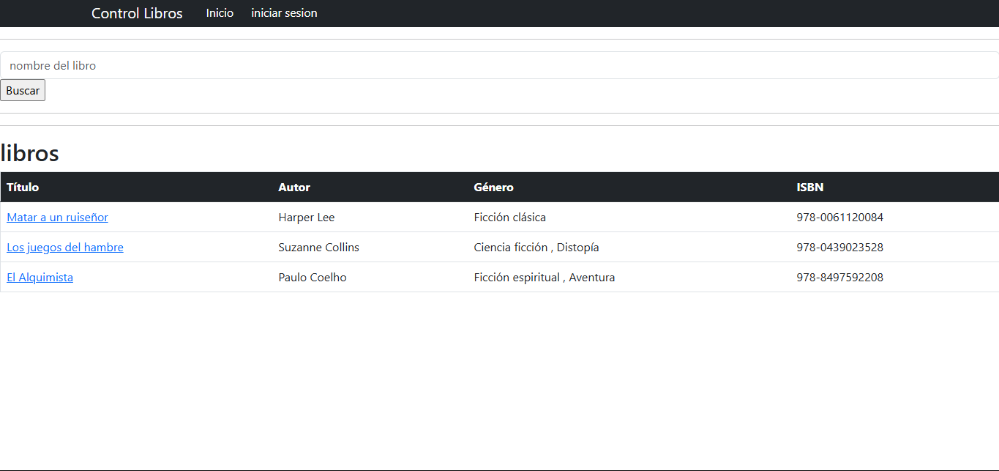
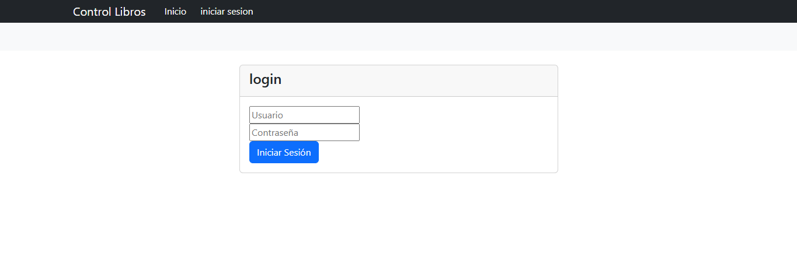
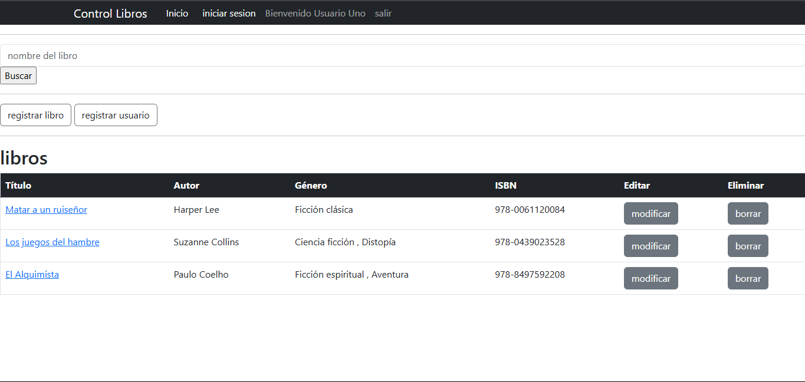
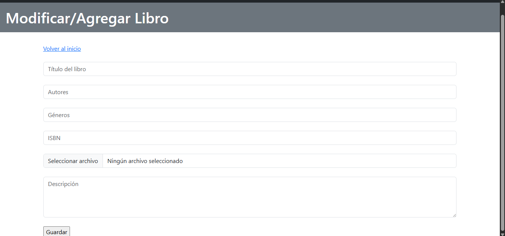

# Aplicación de Gestión de Libros

## Descripción
Esta es una aplicación web desarrollada con Spring Boot para la gestión de libros y usuarios.

## Funcionalidades Principales

### 1. Inicio de Sesión
**Descripción:** Sistema de autenticación para usuarios.

### 2. Gestión de Libros
#### 2.1 Listado de Libros
**Descripción:** Visualización de todos los libros disponibles en el sistema. Si el usuario tiene el rol Admin puede agregar, modificar  y borrar libros si no, no vera estas opciones

#### 2.2 Agregar Nuevo Libro
**Descripción:** Formulario para agregar nuevos libros al sistema.

#### 2.3 Búsqueda de Libros
**Descripción:** Sistema de búsqueda que permite a los usuarios encontrar libros específicos en la biblioteca.

#### 2.4 Detalles del Libro
**Descripción:** Al hacer clic en el título de cualquier libro, el sistema muestra una vista detallada con toda la información del libro seleccionado.

#### 3.2 Registrar Usuario
**Descripción:** Interfaz para registrar información de usuarios.

## Tecnologías Utilizadas
- Spring Boot
- java
- Thymeleaf
- Spring Security
- Base de datos (MySQL)
- Bootstrap personalizado

